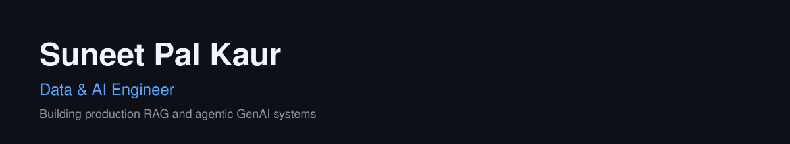

 

## About

Data & AI Engineer with 13+ years across enterprise data platforms and production GenAI systems — Healthcare, BFSI, Supply Chain, Telecom. I build production RAG platforms on Azure OpenAI, agentic multi-agent systems (LangGraph, MCP), multimodal document intelligence, and NL-to-SQL, alongside large-scale data pipelines on Azure (Databricks, Data Factory, Synapse, ADLS), Spark/Scala, and Kafka. 

💬 Ask me about: RAG architecture, hybrid retrieval & reranking, agentic multi-agent systems, MCP, multimodal document intelligence, NL-to-SQL safety, Azure data platforms

---

### 🛠️ Tech Stack

---

## Selected work

- **[hybrid-rag-engine](https://github.com/suneet91/hybrid-rag-engine)** - a hybrid retrieval RAG platform: pgvector cosine search + full-text search, combined with Reciprocal Rank Fusion, cross-encoder reranking, and citation-grounded streaming generation
- **[agentic-fact-verifier](https://github.com/suneet91/agentic-fact-verifier)** - a LangGraph multi-agent system that fact-checks claims using a ReAct search agent, fuzzy entity matching, statistical trust scoring, and an MCP tool server
- **[nl2sql-guardrails](https://github.com/suneet91/nl2sql-guardrails)** - natural-language-to-SQL, grounded with RAG and locked down with multi-layer SQL safety validation, caching, and per-datasource concurrency control
- **[multimodal-doc-auditor](https://github.com/suneet91/multimodal-doc-auditor)** - parallel, fault-tolerant document compliance auditing using GPT-4o Vision plus OCR cross-verification
- **[multi-agent-support-router](https://github.com/suneet91/multi-agent-support-router)** - a LangGraph controller/specialist chatbot that escalates incomplete answers and streams its reasoning live over SSE

---

## Education

- **MIT IDSS Data Science & Machine Learning Program — MIT** *(In Progress, 2026)*
- **Executive PG Programme in Machine Learning & Artificial Intelligence — IIIT Bangalore** *(2021–2022)*
- **Machine Learning Engineer Nanodegree — Udacity** *(2020)*
- **B.Tech. Computer Science — Mody University of Science & Technology** *(2008–2012)*

---

### 📫 Let's connect

